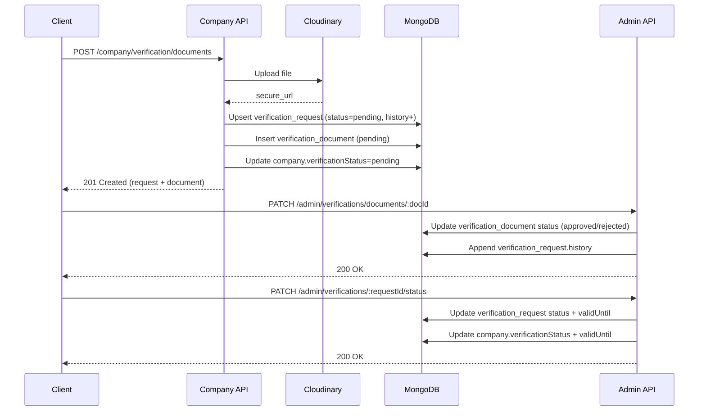

# Company Module Documentation

> Scope: Company module models, routes, controllers, and related verification flow.

## 1. Database Schema Overview

### companyModel
Location: [src/DB/models/company.model.js](../../DB/models/company.model.js)

**Core fields**
- `companyName`, `email`, `companyPhone`: unique identifiers.
- `description`, `industry`, `address`: profile details.
- `numberOfEmployees`: `{ from, to }` range.
- `password`: hashed in `pre("save")` hook.
- `logo`, `coverPic`, `legalAttachment`: Cloudinary file objects.
- `verificationStatus`, `validUntil`: global verification state and expiry.
- `isFeatured`, `rating`, `totalReviews`: public metrics.
- `notifications.email`, `notifications.push`: notification preferences.
- `bannedAt`, `deletedAt`: moderation and soft delete.

**Relations**
- `createdBy` -> `user` (owner/creator).
- `HRs[]` -> `user` list.
- Virtual `jobs` -> `jobOpportunity` by `companyId`.

**Hooks**
- `pre("save")`: bcrypt hash for `password`.
- `pre("remove")`: deletes related internships (via `jobModel`).

**Indexes**
- Text index on `companyName`, `industry`, `address`.

### Verification (related models used by company APIs)
- `verification_request`: stores company verification status + `history[]` timeline.
- `verification_document`: stores per-document status and file URL.

These models are used by the company verification endpoints in this module.

## 2. API Routes Directory

Base path: `/company`

| Method | Endpoint | Auth / Role | Controller Function |
|---|---|---|---|
| POST | /addCompany | `auth(Object.values(roles))` | `addCompany` |
| PUT | /updateCompany/:companyId | `auth(Object.values(roles))` | `updateCompany` |
| DELETE | /softDeleteCompany/:companyId | `auth(Object.values(roles))` | `softDeleteCompany` |
| GET | /getCompany/:companyId | Public | `getCompany` |
| GET | /getCompanyByName | `auth(Object.values(roles))` | `getCompanyByName` |
| PATCH | /uploadCompanyLogo/:companyId | `auth(Object.values(roles))` | `uploadCompanyLogo` |
| PATCH | /UploadCompanyCover/:companyId | `auth(Object.values(roles))` | `UploadCompanyCover` |
| DELETE | /deleteCompanyLogo/:companyId | `auth(Object.values(roles))` | `deleteCompanyLogo` |
| DELETE | /deleteCompanyCover/:companyId | `auth(Object.values(roles))` | `deleteCompanyCover` |
| POST | /signup | Public | `companySignup` |
| POST | /login | Public | `companyLogin` |
| POST | /endorsement-request | `auth([roles.company])` | `sendEndorsementRequest` |
| GET | /applications | `auth([roles.company])` | `getCompanyApplications` |
| GET | /verification | `auth([roles.company])` | `companyVerification` |
| POST | /verification/documents | `auth([roles.company])` | `uploadVerificationDocument` |
| DELETE | /verification/documents/:docId | `auth([roles.company])` | `deleteVerificationDocument` |
| GET | /dashboard | `auth([roles.company])` | `getCompanyDashboard` |
| GET | /settings | `auth([roles.company])` | `getCompanySettings` |
| PATCH | /settings | `auth([roles.company])` | `updateCompanySettings` |
| PATCH | /settings/notifications | `auth([roles.company])` | `updateNotificationPreferences` |
| GET | /search | Public | `searchCompanies` |
| GET | /featured | Public | `getFeaturedCompanies` |
| GET | /allCompanies | Public | `getAllCompanies` |
| GET | /:companyId/internships | Public | `getCompanyInternships` |
| POST | /:companyId/reviews | `auth([roles.student])` | `addCompanyReview` |
| GET | /:companyId/reviews | Public | `getCompanyReviews` |
| GET | /me | `auth([roles.company])` | `getMyCompanyProfile` |
| PATCH | /me | `auth([roles.company])` | `updateMyCompanyProfile` |

## 3. Core Flows

### Flow A: Company Signup
Path: `POST /company/signup`
- Route -> `hostMulter([...image, pdf]).single("legalAttachment")`
- Validation -> `companySignupSchema`
- Controller -> `companySignup`
- DB -> `companyModel.create(...)`

Key side effects:
- Password stored in `companyModel` is hashed by `pre("save")` hook.

### Flow B: Upload Verification Document
Path: `POST /company/verification/documents`
- Route -> `auth([roles.company])`
- Middleware -> `hostMulter([...image, pdf]).single("document")`
- Validation -> `uploadVerificationDocumentSchema`
- Controller -> `uploadVerificationDocument`
- External -> Cloudinary upload to `verification-documents` folder.
- DB -> `verification_request` create/update + append `history`.
- DB -> `verification_document` create.
- DB -> Update `company.verificationStatus` to `pending`.

### Flow C: Send Endorsement Request
Path: `POST /company/endorsement-request`
- Route -> `auth([roles.company])`
- Validation -> `sendEndorsementRequestSchema`
- Controller -> `sendEndorsementRequest`
- DB checks -> internship ownership, university existence, duplicate approval.
- DB -> `internship_approval` create with status `pending`.

### Flow D: Add Company Review
Path: `POST /company/:companyId/reviews`
- Route -> `auth([roles.student])`
- Validation -> `addCompanyReviewSchema`
- Controller -> `addCompanyReview`
- DB -> Create `companyReview`, aggregate rating stats, update `company.rating` and `company.totalReviews`.

## 4. Mermaid Sequence Diagram (Verification Flow)

